<p align="center">
  
</p>

<p align="center">
  
  
  
  
</p>

<p align="center">
  <a href="#install">Install</a> &nbsp;·&nbsp;
  <a href="#usage">Usage</a> &nbsp;·&nbsp;
  <a href="#ai-review--free-or-paid">AI review</a> &nbsp;·&nbsp;
  <a href="#security">Security</a> &nbsp;·&nbsp;
  <a href="docs/ai-providers.md">Docs</a>
</p>

---

AI assistants write code that *runs*, not code that's *safe*. They reach for
`eval`, `shell=True`, `innerHTML`, hardcoded keys, and outdated packages because
those are the shortest path to "it works." **XSEC hunts for exactly those
mistakes** — and can rewrite many of them for you.

```bash
xsec scan .                 # scan the current project
xsec scan . --fix           # find issues AND auto-fix the safe ones
xsec scan . --ai --deps     # add AI review + dependency CVE checks
```

## Why XSEC

- **Finds real vulnerabilities** — command/SQL injection, unsafe
  deserialization, weak crypto, hardcoded secrets (AWS/GitHub/Stripe/Slack/
  Google/AI-provider keys), XSS sinks, XXE, JWT bypass, and more.
- **Fixes them for you** — AST-precise mechanical refactors, plus
  **AI-powered rewrites** (`--ai-fix`) that are verified gone before they
  ever touch disk.
- **Multi-language** — Python (AST), JavaScript/TypeScript and Java
  (tree-sitter syntax-aware when installed, regex otherwise), plus AI review
  for any language.
- **Free or paid AI** — use Claude (best quality) or a **free** provider
  like Groq/OpenRouter. Off by default; your code stays local unless you opt
  in. Concurrent and **content-hash cached**: re-scans only bill changed files.
- **Dependency scanning** — manifests *and* lockfiles (`package-lock.json`,
  `poetry.lock`, `uv.lock`) checked against known CVEs (OSV).
- **Private and secure by design** — runs locally, encrypted key storage,
  input-hardened against hostile repos, no network unless you ask.
- **Editor and CI ready** — VS Code extension, SARIF output, exit-code gating,
  config files, and baselines for legacy codebases.

## Install

Requires Python 3.10+.

```bash
pip install -e .                      # core scanner (Python/JS/TS/Java, offline)
pip install -e ".[ai]"                # + Anthropic Claude AI review
pip install -e ".[deps]"              # + dependency CVE scanning (OSV)
pip install -e ".[secure]"            # + encrypted API-key storage (keyring)
pip install -e ".[treesitter]"        # + syntax-aware JS/TS/Java (fewer false positives)
pip install -e ".[ai,deps,secure,treesitter]"   # everything
```

## Engines

Every engine emits the same `Finding` shape, so all reports and the editor
integration work identically regardless of which engine produced a result.

| Engine | What it does |
| --- | --- |
| **SAST (Python)** | AST + regex analysis — SQL injection, command injection, unsafe deserialization, JWT/SSL bypass, XXE, weak crypto, secrets, … |
| **SAST (JS/TS, Java)** | Syntax-aware via tree-sitter (optional) or rule-based — no false positives from comments/strings |
| **Auto-fix** | Mechanical AST rewrites + verified AI rewrites (see below) |
| **AI review** | Opt-in semantic review via Claude or a free provider, any language |
| **Dependency / CVE** | Checks manifests and lockfiles against OSV |

## Usage

```bash
xsec scan path/to/code
xsec scan examples/vulnerable.py          # try a bundled sample
xsec scan . --min-severity MEDIUM         # hide low-severity noise
xsec scan . --json                        # machine-readable output
xsec scan . --sarif                       # GitHub code scanning format
xsec scan . --html report.html            # self-contained visual report
xsec scan . --fail-on HIGH                # non-zero exit for CI gating
```

### Auto-fix

XSEC doesn't just report — it can **rewrite the unsafe code for you**:

```bash
xsec scan . --fix                # apply only semantics-preserving fixes
xsec scan . --fix --unsafe-fixes # also apply fixes that may change behavior
xsec scan . --ai-fix             # AI rewrites the file; verified before writing
```

Mechanical fixes are AST-precise (never blind text replace) and every patched
file is re-parsed before being written — if a fix would break the file, it's
discarded.

`--ai-fix` goes further: the AI provider rewrites each affected file, and the
rewrite is only written if it **parses, keeps a sane size, removes at least
one static finding on re-scan, and introduces none**. Applied fixes are shown
as unified diffs.

| Fix | Confidence | Applied by |
| --- | --- | --- |
| `yaml.load` → `yaml.safe_load` | safe | `--fix` |
| `hashlib.md5/sha1` → `hashlib.sha256` | risky (digest changes) | `--unsafe-fixes` |
| `debug=True` → `debug=False` | risky | `--unsafe-fixes` |

Issues with no safe mechanical fix (`eval`, `os.system`, `pickle`, hardcoded
secrets) are reported with remediation guidance instead.

### AI review — free or paid

Rule-based scanning only finds patterns someone wrote a rule for. The AI engine
reads code like a reviewer — catching broken auth, logic flaws, and unsafe data
flows in **any** language. It's **opt-in**; XSEC stays free and offline unless
you enable it.

You choose the provider — best quality (paid) or free:

```bash
# Free — get a key at console.groq.com, store it encrypted, then scan:
xsec key set --provider groq
xsec scan . --ai --ai-provider groq

# Paid / best quality (Claude):
xsec key set                 # stores your Anthropic key
xsec scan . --ai
```

See [docs/ai-providers.md](docs/ai-providers.md) for the full comparison
(quality, cost, privacy) and self-hosted/OpenAI-compatible setups. API keys are
stored **encrypted in your OS keyring**, never in a file or your shell history.

### Dependency / CVE scanning

```bash
xsec scan . --deps    # check manifests + lockfiles against OSV
```

Reads `requirements.txt`, `package.json`, **and lockfiles**
(`package-lock.json`, `poetry.lock`, `uv.lock` — every pinned transitive
dependency). Sends only package names and versions to the free
[OSV](https://osv.dev) database; opt-in like AI review.

### Config file

Drop an `.xsec.toml` at your project root to set defaults and quiet noise (see
[.xsec.toml.example](.xsec.toml.example)):

```toml
[scan]
min_severity = "MEDIUM"

[ai]
provider = "groq"

[ignore]
paths = ["tests/", "examples/"]
rules = ["PY-WEAK-HASH"]
```

CLI flags always override the config file.

To silence one finding at its source, use an inline comment instead:

```python
subprocess.run(cmd, shell=True)   # xsec: ignore[PY-SUBPROCESS-SHELL]
```

A bare `# xsec: ignore` (or `// xsec: ignore` in JS/Java) silences every rule
on that line; the scan summary reports how many findings were suppressed.

### Baseline (adopt on an existing project)

Snapshot today's findings once, then only see *new* issues going forward — ideal
for legacy codebases and CI gates:

```bash
xsec baseline .            # writes .xsec-baseline.json (commit it)
xsec scan . --baseline     # only reports findings not in the snapshot
```

## GitHub Action

Add XSEC to any repository's CI and have findings appear in the Security tab.
Findings are tagged with their [CWE](https://cwe.mitre.org) id, so code scanning
groups them by weakness automatically.

```yaml
# .github/workflows/security.yml
name: security
on: [push, pull_request]
permissions:
  contents: read
  security-events: write   # to upload SARIF
jobs:
  xsec:
    runs-on: ubuntu-latest
    steps:
      - uses: actions/checkout@v4
      - uses: LEXES7/XSEC@main
        with:
          path: .
          fail-on: HIGH      # fail the build on HIGH+ findings
          deps: "true"       # also scan dependencies for CVEs
```

Every report format carries CWE data: SARIF emits a full CWE taxonomy, and
`--json` adds a `"cwe"` field to each finding.

## VS Code extension

Inline squiggles, a status-bar shield, and one-click auto-fix as you work. See
[vscode-extension/](vscode-extension/). Build it with `npm install && npm run compile`,
then press **F5**, or package a `.vsix` with `vsce package`.

## Security

XSEC scans untrusted code, so it treats its own input as an attack surface —
file-size and line-length limits, no symlink following, binary skipping, and
ReDoS-resistant rules. The VS Code extension respects Workspace Trust and runs
the CLI without a shell. See [SECURITY.md](SECURITY.md) for the full threat
model.

## Develop

```bash
pip install -e ".[dev]"
pytest
```

## Layout

```
xsec/
  cli.py                 command-line interface and orchestration
  models.py              Finding / Severity / ScanResult
  discovery.py           file walking + ignore rules
  config.py              .xsec.toml parsing
  baseline.py            snapshot / new-findings-only
  suppress.py            inline `xsec: ignore` comments
  fix.py                 mechanical AST auto-fixes
  aifix.py               AI-powered verified rewrites (--ai-fix)
  safety.py              resource limits for untrusted input
  parallel.py            process-pool scanning
  secrets.py             encrypted per-provider API-key storage
  cwe.py                 rule-id to CWE weakness mapping
  engines/               sast, treesitter/regex (js/java), deps, ai_review, openai_compatible
  rules/                 python / javascript / java rule sets + shared secrets
  report/                console, JSON, SARIF, HTML
vscode-extension/        VS Code integration
website/                 product site (static, GitHub Pages-ready)
```

## Roadmap

- [x] SAST: Python (AST), JS/TS/Java (tree-sitter / rules)
- [x] Auto-fix engine (safe/risky confidence, re-parse guard)
- [x] **AI-powered auto-fix** (`--ai-fix`, verified rewrites)
- [x] AI review — Claude **and** free providers (Groq/OpenRouter), concurrent + cached
- [x] Dependency / CVE scanning (OSV) — manifests + lockfiles
- [x] Reports: console / JSON / SARIF / HTML, all CWE-tagged
- [x] Config (`.xsec.toml`) + baseline + inline suppressions
- [x] VS Code extension · encrypted key storage · CI · product site
- [x] Reusable GitHub Action (`LEXES7/XSEC@main`)
- [ ] Dataflow / taint tracking (source → sink)
- [ ] More languages (Go, Ruby, PHP, …)
- [ ] PyPI / VS Code Marketplace releases

## License

MIT — see [LICENSE](LICENSE).
